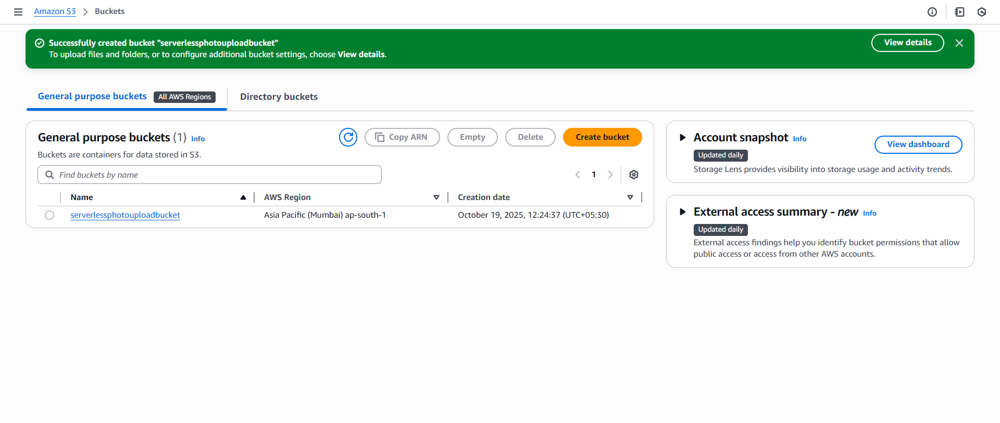
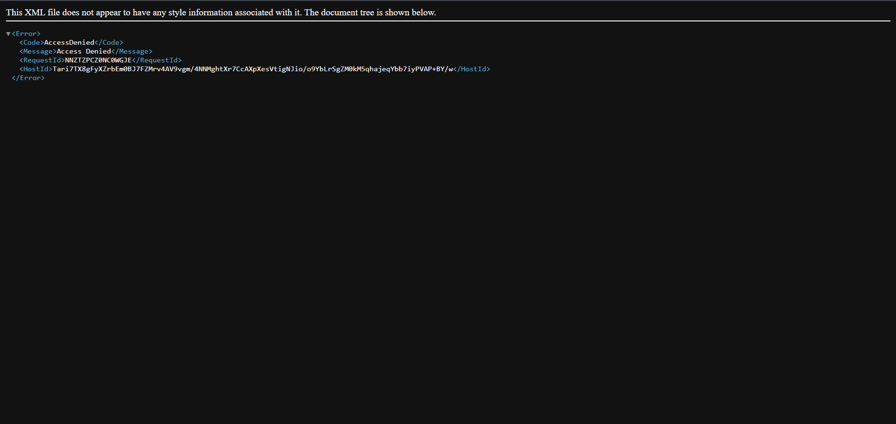

# servless-photo-upload

🧩 Overview

This project demonstrates a serverless photo upload application built using AWS Lambda, S3, and IAM.
The Lambda function uploads photos to an S3 bucket and returns the public URL of the uploaded image.

⚙️ Architecture

Services used:

AWS Lambda – Handles the file upload logic.

Amazon S3 – Stores uploaded images.

IAM – Grants permissions for Lambda to access S3.

🗂 Folder Structure

📁 ServerlessPhotoUpload

 ├── lambda_function.py   # Main Lambda code
 ├── README.md            # Project documentation

🚀 Steps to Deploy

1️⃣ Create an S3 Bucket

Open AWS Console → S3 → Create bucket

Name it something unique, e.g. serverlessphotouploadbucket

Keep ACLs enabled and Block all public access unchecked (optional — can change later).

Click Create bucket

2️⃣ Make S3 Bucket Public

If you get an “Access Denied” XML when opening your uploaded image, your bucket isn’t public.

➤ Disable Block Public Access

Go to S3 → Your Bucket → Permissions → Block public access

Click Edit

Uncheck all boxes

Save changes

➤ Add Bucket Policy

Go to Permissions → Bucket Policy and paste:

{
  "Version": "2012-10-17",
  "Statement": [
     {
      "Sid": "PublicReadForObjects",
      "Effect": "Allow",
      "Principal": "*",
      "Action": "s3:GetObject",
      "Resource": "arn:aws:s3:::serverlessphotouploadbucket/*"
    }
  ]
}

✅ This allows public read access for all files inside your bucket.

3️⃣ Create IAM Role for Lambda

Go to IAM → Roles → Create Role

Choose AWS Service → Lambda

Attach the following policies:

AmazonS3FullAccess

AWSLambdaBasicExecutionRole

Click Create Role

4️⃣ Create Lambda Function

Go to Lambda → Create function

Choose Author from scratch

Function name: PhotoUploadHandler

Runtime: Python 3.9

Choose the IAM role created above

Click Create function

5️⃣ Add Lambda Code

6️⃣ Deploy and Test

Click Deploy

Click Test

Create a test event with base64 image data or dummy text

Run the test

You should see:

{
  "statusCode": 200,
  "body": "{\"message\": \"✅ File uploaded successfully!\", \"file_url\": \"https://serverlessphotouploadbucket.s3.ap-south-1.amazonaws.com/your_image.jpg\"}"
}

✅ Output Example

File uploaded successfully!
URL: https://musuujljeipo3ylarkb6vowen40godcj.lambda-url.ap-south-1.on.aws/

🏁 Conclusion

This project demonstrates how to build a Serverless Photo Upload Application using AWS Lambda and Amazon S3, without managing any servers.

It’s a great hands-on project to understand:

How serverless architecture works

How AWS services integrate with each other (Lambda, S3, IAM)

How to make cloud-based applications secure and efficient

